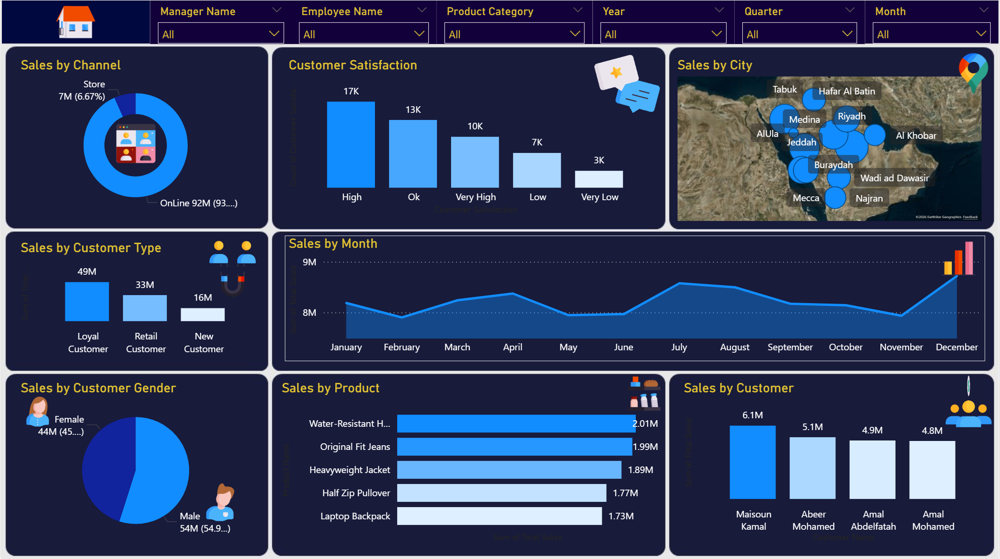
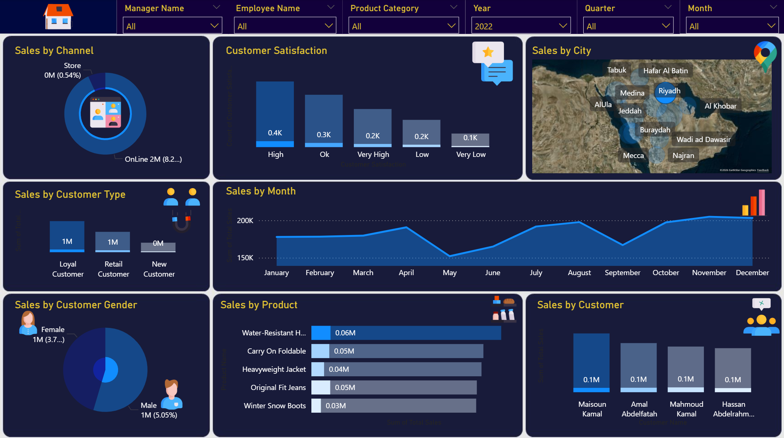

# 📊 Sales & Customer Analytics Dashboard (Power BI)

## 📌 Overview
An interactive Power BI dashboard designed to analyze sales performance, channel distribution, regional trends, and customer satisfaction metrics to support data-driven decision-making.

---

## 📸 Dashboard Preview

### 1. Full Dashboard Overview

### 2. Interactive Filtering (Filtered View)

---

## 🔑 Key Features & Insights
- **Sales Channel Analysis:** Comparison between Online and Store sales performance.
- **Geographic Distribution:** Interactive map showing sales across Saudi cities (Riyadh, Jeddah, Al Khobar, etc.).
- **Customer Satisfaction:** Tracking feedback ratings from High to Very Low.
- **Sales Trends:** Monthly revenue performance to identify peak sales periods.
- **Top Products & Customers:** Highlighting best-selling products and top-contributing customers.

---

## 🛠️ Tools & Technologies Used
- **Power BI Desktop:** Report building & UI/UX design (Dark Theme).
- **Power Query:** Data cleaning, transformations, and custom column definitions.
- **DAX:** Dynamic calculations and KPI measures.
- **Microsoft Excel:** Source dataset management.

---

## 📁 Repository Contents
- `Mazen Project.pbix`: Full interactive Power BI report file.
- `Interactive Dashboards Start.xlsx`: Raw source dataset.
- `Dashboard_full.png`: High-resolution main view.
- `Dashboard_filtered.png`: Interactive filter demonstration view.
